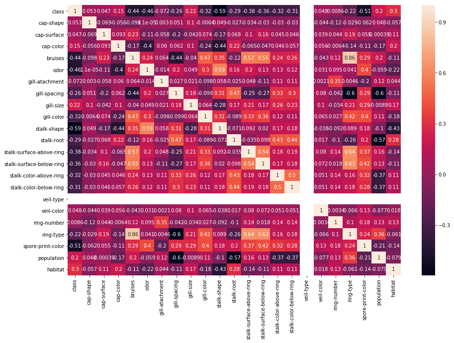

# This is the Project regarding Naive Bayes over Mushroom dataset which involves label encoding first and then finding probabilities of each attributes different categories given both edible or poisonous classes and finally using those probabilities to find the probability for edible or poisnous for a new instance.

This is the heatmap displaying the correlation which is very less between the attributes which shows they are almost independent and naive bayes will be good for applying on this dataset as naive bayes assumes that the features are independent.